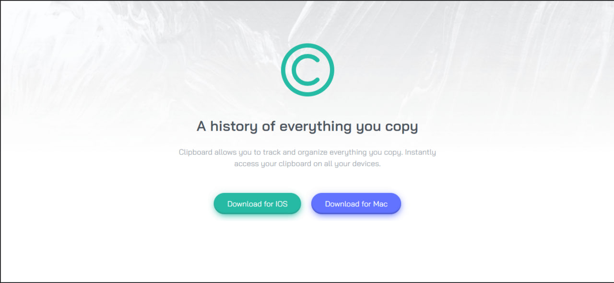
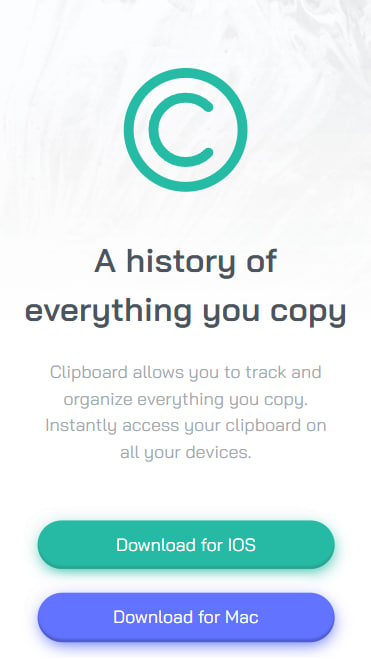

# Frontend Mentor - Clipboard landing page solution

This is a solution to the [Clipboard landing page challenge on Frontend Mentor](https://www.frontendmentor.io/challenges/clipboard-landing-page-5cc9bccd6c4c91111378ecb9). Frontend Mentor challenges help you improve your coding skills by building realistic projects. 

## Table of contents

- [Overview](#overview)
  - [The challenge](#the-challenge)
  - [Screenshot](#screenshot)
  - [Links](#links)
- [My process](#my-process)
  - [Built with](#built-with)
  - [What I learned](#what-i-learned)
  - [Continued development](#continued-development)
  - [Useful resources](#useful-resources)
- [Author](#author)
- [Acknowledgments](#acknowledgments)

**Note: Delete this note and update the table of contents based on what sections you keep.**

## Overview

### The challenge

Users must be able to:

- See the optimal design for the site according to the screen size of your device
- View hover states for all interactive elements on the page

I could say that this is my first landing page in bootstrap. I always use some custom css and some bootstrap selector, right now I'm still learning how to implement its full power in HTML and CSS.

In fact, I need to clean up the html code a bit in this layout, but I need to continue with another project, for now I'm happy with the result.

### Screenshot

### Links

- Solution URL: [Frontend Mentor Solution](https://your-solution-url.com)
- Live Site URL: [Clipboard Landing](https://arr-clipboard-landing-page.vercel.app/)

## My process
This project was not supposed to be this long. I was working this solution in laravel to practice more with blade and libraries like sass, bootstrap etc. in that environment.

When I finished the solution, I got really frustrated trying to deploy the project with the railway (sad Heroku moment), so I decide to do it statically.

PS.If anyone knows a platform where to implement a project like laravel, please let me know...

### Built with

- Semantic HTML5 markup
- SCSS custom properties
- Flexible box
- First mobile workflow
- [Bootstrap](https://getbootstrap.com/) - For Bootstrap style containers and layouts
- [SASS](https://sass-lang.com/) - To compile CSS
- [Swiper Js](https://styled-components.com/) - For Client Carousel section
- [AOS Animation](https://styled-components.com/) - For animation of scrolling sections

### What I learned
I think the best part of this project was finding a better vision to lay out each section and how each one works on top of another.

I learned a lot about how to better structure my HTML to get an advantage in CSS and better responsive results.

### Continuous development
as i said before, i would like to do more projects in Laravel, i also want to do some applications in React or focus on a new technology... but all in due time

## Author

- Website - [Lucas E.](https://arr-dev.vercel.app)
- Frontend Mentor - [@arrejoria](https://www.frontendmentor.io/profile/arrejoria)
